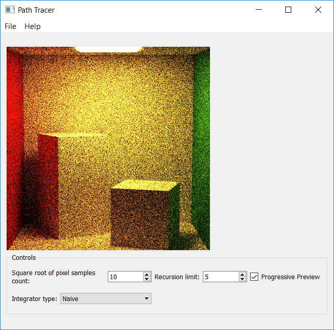
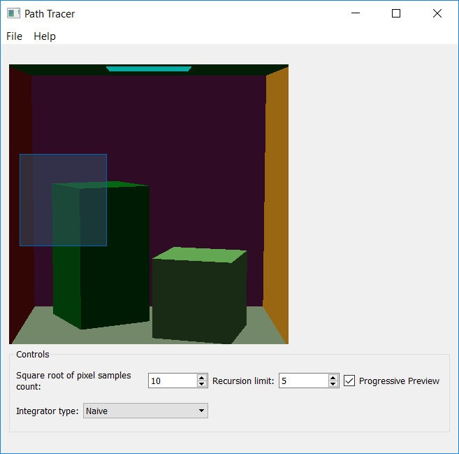
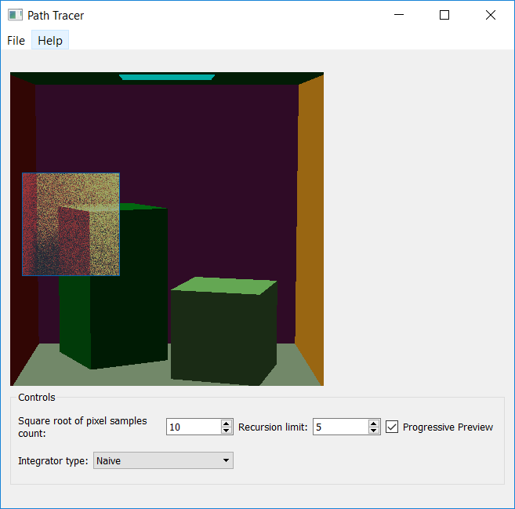
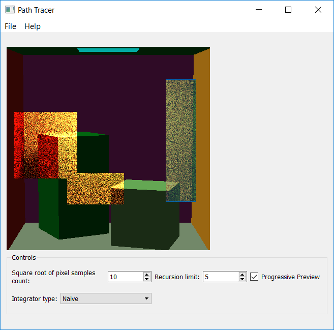
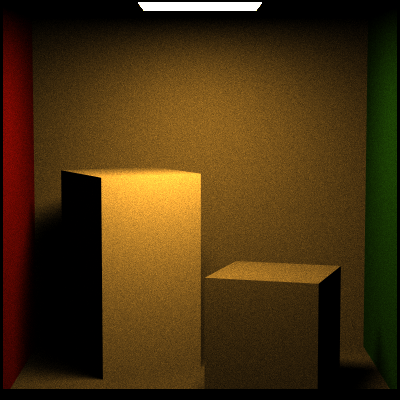

Progressive rendering and render region
---------------------------------------
We also have added functionality to progressively render scenes based on the regions you select. By default, if you hit render, you would see the OpenGL preview change to the render of the scene.

The preview scene will show up if you move your camera and then set it to render.

The render region works with the progressive renderer, similar to what exists in Maya.

Click and drag region in the GL preview and hit render.

 Overview
------------
* a na&#239;ve Monte Carlo path tracer
* path tracer with direct lighting intergrator to estimate the direct lighting in a scene by sampling points
on light surfaces, and a collection of `BxDF`s to handle specular reflective and
transmissive materials, 
* an updated DirectLightingIntegratorthat improves the way it samples the direct on complex surfaces such as the new microfacet materials we've provided.
*  path tracer with full lighting intergrator, which will compute both the direct lighting 
and global illumination at each ray intersection to produce a more converged image in a shorter period of time.

result
------------------
100 sample 1 recusrion cos weight

100 sample 5 recursrion cos weight

100 sample 1 recusrion uniform

100 sample 5 recusrion uniform

* navie integrator image

The Light Transport Equation
--------------
#### Lo(p, &#969;o) = Le(p, &#969;o) + &#8747;S f(p, &#969;o, &#969;i) Li(p, &#969;i) V(p', p) |dot(&#969;i, N)| _d_&#969;i

* __Lo__ is the light that exits point _p_ along ray &#969;o.
* __Le__ is the light inherently emitted by the surface at point _p_
along ray &#969;o.
* __&#8747;S__ is the integral over the sphere of ray
directions from which light can reach point _p_. &#969;o and
&#969;i are within this domain. In general, we tend to only care
about one half of this sphere, determining the relevant half based on the
reflectance or transmittance of the BSDF.
* __f__ is the Bidirectional Scattering Distribution Function of the material at
point _p_, which evaluates the proportion of energy received from
&#969;i at point _p_ that is reflected along &#969;o.
* __Li__ is the light energy that reaches point _p_ from the ray
&#969;i. This is the recursive term of the LTE.
* __V__ is a simple visibility test that determines if the surface point _p_' from
which &#969;i originates is visible to _p_. It returns 1 if there is
no obstruction, and 0 is there is something between _p_ and _p_'. This is really
only included in the LTE when one generates &#969;i by randomly
choosing a point of origin in the scene rather than generating a ray and finding
its intersection with the scene.
* The __absolute-value dot product__ term accounts for Lambert's Law of Cosines.

